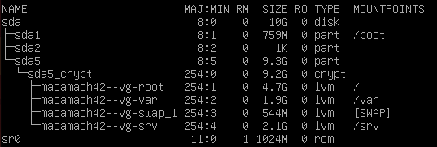
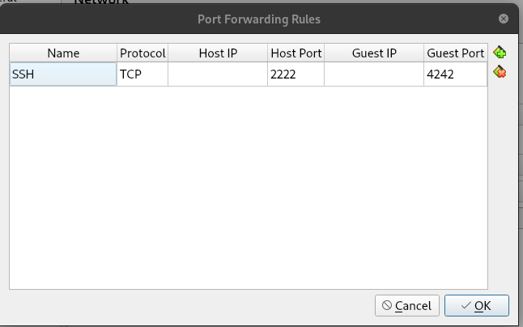

# Born2beRoot Project
*This project has been created as part of the 42 curriculum by macamach*
## Description
This project introduces fundamental concepts of System Administration and virtualization. The core goal is to set up a server within a Virtual Machine (VM) using configuration rules, focusing on security, partitioning, user management, and system monitoring.

The final deliverable is a functional VM and a signature.txt file containing the SHA-1 signature of the virtual disk.

## Project Setup and Instructions

This project requires the use of VirtualBox (or UTM for MacM1 users). 
I choose VirtualBox because it was available no campus, had more documentation and was used by my peers.

Operating System Choice: The project was completed using the latest stable version of Debian (deb13-amd64) because it is highly recommended for newcomers to system administration.

Partitioning and Storage: The server utilizes LVM (Logical Volume Management) to create at least 2 encrypted partitions.

The partitioning scheme chosen is:

     
Advantages: Separate partitions for /var and /srv, is generally considered **more robust** and **more secure** for a server environment. The advantages come from the principle of separating frequently changing or volatile data (/var)  from core system files (/srv).

Security Configuration: The following tools were installed:

- AppArmor: Mandatory Access Control security system. Restricts the capabilities of individual programs on your system. It operates by using profiles for programs. A program (like an SSH service or a web server) can only access the resources defined in its profile. (It is installed by default with Debian)
- Firewall: UFW (Uncomplicated Firewall) 
- sudo: allow users to execute commands with privileges of root, keep a log of commands
- libpam-pwquality: password policy manager

For password policy configuration the following files were modified: 
	1) Configuration file /etc/login.defs was modified
	2) From libpam-pwquality, file /etc/pam.d/common-password

For system monitoring: A Bash script named monitoring.sh was implemented to display information about the system. The scripts is located in /usr/local/bin and its run with the root crontab -e. It runs each 10 minutes.

For SSH configuration the following files were modified: 
	1) /etc/ssh/sshd_config
For SSH service VM used port 4242 and Host Machine port 2222

## Comparations
- Debian vs Rocky
Both are Linux versions of medium complexity. Debian is commonly used for non-enterprise environments, while Rocky is typically used in enterprise environments. Debian is Free Software; Rocky is also Free Software but has the option for subscription to value-added services and enterprise technical support. This subscription service is provided by the company RHEL (Red Hat Enterprise Linux), currently owned by IBM.

- AppArmor vs SELinux
Both are Mandatory Access Control (MAC) security systems. AppArmor is for Debian, and SELinux is for Rocky. AppArmor uses a security model based on Paths, and SELinux is based on Types, which makes it more granular and more complex to use.

- UFW vs firewalld
These are interfaces used to configure the Linux firewall. UFW is simpler and faster and covers simple requirements. Firewalld is ideal for servers with multiple network interfaces that require different levels of trust. UFW is found with Debian and Ubuntu, while firewalld is found with Rocky.

- VirtualBox vs UTM
Both are software used to install and run virtual machines. They are optimized for different operating systems. VirtualBox is Multi-platform, and UTM is exclusive to macOS, iOS/iPadOS.

- aptitude vs apt
Package management tools in Debian. Both perform the same job. Aptitude has a graphical interface, but apt does not; apt is recommended for daily use for package installation, updating, and removal. Aptitude is recommended for advanced management and conflict resolution (such as removing unused dependencies)

## Resources
Used this online guides

[Guia 1] https://github.com/chlimous/42-born2beroot_guide?tab=readme-ov-file#operating-system-installation

[Guia 2] https://noreply.gitbook.io/born2beroot/installing-the-virtual-machine/virtual-machine-iso

And also AI for get basic information about AppArmor, sudo, partitions, shell instructions, crontab beween others.

## Commands

### Check AppArmor
$ sudo aa-status

### Install and config Firewall
$ apt install ufw 
$ ufw default deny incoming
$ ufw default allow outgoing

### Setup puerto 4242
$ ufw allow 4242
$ ufw enable

### Check ufw status
$ systemctl status ufw
$ sudo ufw status

### Install and config sudo
$ apt install sudo
$ Defaults secure_path="/usr/local/sbin:/usr/local/bin:/usr/sbin:/usr/bin:/sbin:/bin"
$ Defaults requiretty
$ Defaults badpass_message="WRONG PASSWORD"
$ Defaults logfile="/var/log/sudo/sudo.log"
$ Defaults iolog_dir=/var/log/sudo
$ Defaults log_input
$ Defaults log_output
$ Defaults passwd_tries=3

### Add a group
$ groupadd user42

### List groups
$ getent group | awk -F: '{ print $1 }'

### List the gruops of a user
$ groups macamach

### Add a new user
$ sudo adduser rafael

### Add a user to a group
$ sudo usermod -a -G user42,sudo macamach

### List users of a group
$ getent group sudo

### Apply password policies by command
$ chage -M 30 username | Sets PASS_MAX_DAYS to 30 days
$ chage -m 2 username | Sets PASS_MIN_DAYS to 2 days

### Library password lib
$ apt install libpam-pwquality

### Change password (libpam-pwquality)
$ passwd user

### Open crontab
$ crontab -e

### Check ssh statusudo ufw statuss
$ systemctl status ssh

### Restart ssh service
$ systemctl restart ssh

### Open ports
$ ss -tunlp

### Change password
$ passwd

### Loged user
$ whoami